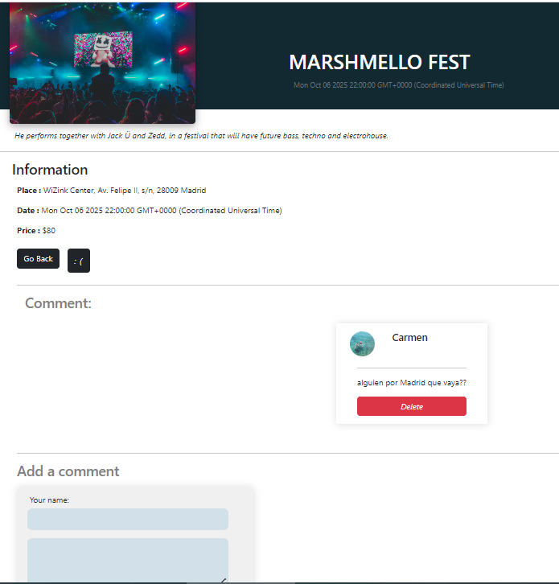

<h1>Festiwink, our second Project in Ironhack!!!</h1>

It is an application about festivals and parties using Model–view–controller (MVC).
As a No loger user you can check all the events and their details.
<h3>Home</h3>

<h3>Festivals</h3>

As a loger user you can comment on the detail of the event, like it (it will appear in your profile as your favorite for checking it later) and create a party.

<h3>Festival's detail page</h3>

<h3>Profile page</h3>

<h3>Create festival page</h3>

The most technical challenge has been relating all the models in the project and creating the like feature and making that the event remembers the likes and users.

We would like to implement in the future the location of the festivals with google maps and some playlist of the festival.

https://festiwink-production.up.railway.app

thanks for reading ;)

<h3>Login page</h3>

<h3>Register page</h3>

<h3>Navbar</h3>
Here you can search by category the events, and you have the shortcuts.

<h3>Footer</h3>
Here you can go to our linkeding and github pages, and know more about us on the about page.

<h6>By Violeta & Carmen García Guzmán</h6>
